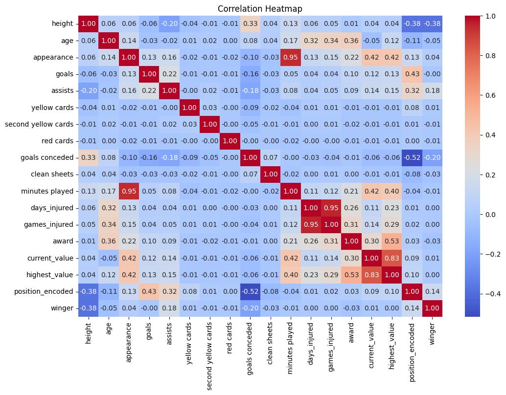

# Football Dataset Analysis

## Overview

This project analyzes a football dataset containing 10,754 player records across 22 variables. The analysis includes descriptive statistics and relationships between variables to understand player performance and trends.

## Numerical Analysis

### **Key Findings:**

- **Player Age**: Average **26.04 years**, typical for professional players.
- **Height**: Average **181.24 cm**, within the expected range for footballers.
- **Minutes Played**: High variance (**Std Dev = 2021.70**), indicating a large gap between starters and substitutes.
- **Goals & Assists**: Highly skewed distribution, with only a few high-performing players contributing significantly.
- **Red Cards**: Extremely skewed, meaning most players have zero, but a few accumulate many.
- **Injuries**: Large variation, showing that some players rarely get injured while others miss multiple seasons.
- **Clean Sheets**: Highly skewed, indicating that only a few goalkeepers manage a high number of clean sheets.

## Bivariate/Multivariate Analysis

### **Key Insights:**

- **Correlation Matrix (Heatmap)**:

  - **Positive correlation** between `goals` and `assists`.
  - **Negative correlation** between `age` and `minutes played` (older players tend to play less).
  - **High correlation** between `current_value` and `highest_value`.

- **Scatter Plots**:
  - Players with more `minutes played` tend to have higher `goals` and `assists`.
  - Defenders and midfielders accumulate more `yellow cards` compared to other positions.

- **Box Plots**:
  - **Injury distribution** shows that some players are far more prone to injuries than others.
  - Goalkeepers tend to have **zero goals and assists**, while forwards dominate these metrics.

## Conclusion

- The dataset provides valuable insights into player performance and trends.
- Clear patterns exist in `goals`, `assists`, `injuries`, and `cards`, showing different player contributions.
- Some variables have extreme skewness, indicating outliers.
- Future analysis can explore predictive modeling for player performance.

