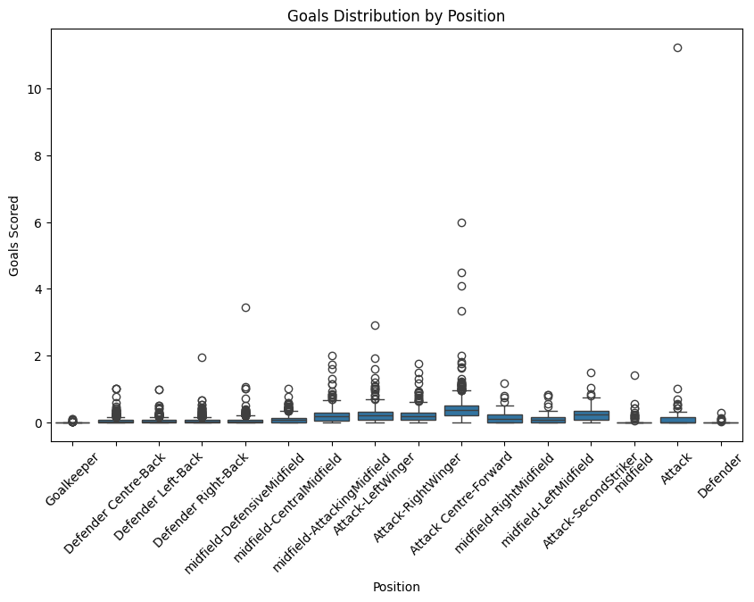

# Football Dataset Analysis

## Overview

This project analyzes a football dataset containing 10,754 player records across 22 variables. The analysis includes descriptive statistics and relationships between variables to understand player performance and trends.

## Numerical Analysis

### **Key Findings:**

- **Player Age**: Average **26.04 years**, typical for professional players.
- **Height**: Average **181.24 cm**, within the expected range for footballers.
- **Minutes Played**: High variance (**Std Dev = 2021.70**), indicating a large gap between starters and substitutes.
- **Goals & Assists**: Highly skewed distribution, with only a few high-performing players contributing significantly.
- **Red Cards**: Extremely skewed, meaning most players have zero, but a few accumulate many.
- **Injuries**: Large variation, showing that some players rarely get injured while others miss multiple seasons.
- **Clean Sheets**: Highly skewed, indicating that only a few goalkeepers manage a high number of clean sheets.

## Bivariate/Multivariate Analysis

### **Key Insights:**

- **Correlation Matrix (Heatmap)**:

  - **Positive correlation** between `goals` and `assists`.
  - **Negative correlation** between `age` and `minutes played` (older players tend to play less).
  - **High correlation** between `current_value` and `highest_value`.

- **Scatter Plots**:
  - Players with more `minutes played` tend to have higher `goals` and `assists`.
  - Defenders and midfielders accumulate more `yellow cards` compared to other positions.

- **Box Plots**:

  - **Injury distribution** shows that some players are far more prone to injuries than others.
  - Goalkeepers tend to have **zero goals and assists**, while forwards dominate these metrics.

## Machine Learning Models Used
The following machine learning models were applied to the dataset to predict player performance and other metrics. Below are the accuracy scores for both training and testing datasets, expressed as percentages:

---

### **Linear Regression**
- **Purpose**: Predict continuous variables such as player value or minutes played.
- **R² Score (Training)**: **75.70%**
- **R² Score (Testing)**: **76.27%**

---

### **Lasso Regression**
- **Purpose**: Regularized linear regression to prevent overfitting.
- **R² Score (Training)**: **75.70%**
- **R² Score (Testing)**: **76.27%**

---

### **Ridge Regression**
- **Purpose**: Regularized linear regression to handle multicollinearity.
- **R² Score (Training)**: **75.70%**
- **R² Score (Testing)**: **76.27%**

---

### **Logistic Regression**
- **Purpose**: Classify players into categories (e.g., high-performing vs. low-performing).
- **Accuracy (Training)**: **78.28%**
- **Accuracy (Testing)**: **78.34%**

---

### **Decision Trees**
- **Purpose**: Predict player performance and classify players.
- **Accuracy (Training)**: **86.62%**
- **Accuracy (Testing)**: **81.17%**

---

### **Random Forest**
- **Purpose**: Improve prediction accuracy by combining multiple decision trees.
- **Accuracy (Training)**: **86.83%**
- **Accuracy (Testing)**: **85.50%**

---

### **K-Nearest Neighbors (KNN)**
- **Purpose**: Classify players based on similarity metrics (e.g., position, performance).
- **Accuracy (Training)**: **81.84%**
- **Accuracy (Testing)**: **81.54%**

---

### **K-Means Clustering**
- **Purpose**: Group players into clusters based on similar attributes (e.g., performance, position).
- **Silhouette Average Score**: **18.17%**
- **Note**: Used for exploratory analysis, not for accuracy measurement.

---

### Summary of Results
| Model               | Training Score | Testing Score |
|---------------------|----------------|---------------|
| Linear Regression   | R² = 75.70%    | R² = 76.27%   |
| Lasso Regression    | R² = 75.70%    | R² = 76.27%   |
| Ridge Regression    | R² = 75.70%    | R² = 76.27%   |
| Logistic Regression | Accuracy = 78.28% | Accuracy = 78.34% |
| Decision Trees      | Accuracy = 86.62% | Accuracy = 81.17% |
| Random Forest       | Accuracy = 86.83% | Accuracy = 85.50% |
| KNN                 | Accuracy = 81.84% | Accuracy = 81.54% |
| K-Means Clustering  | Silhouette Score = 18.17% | N/A |
