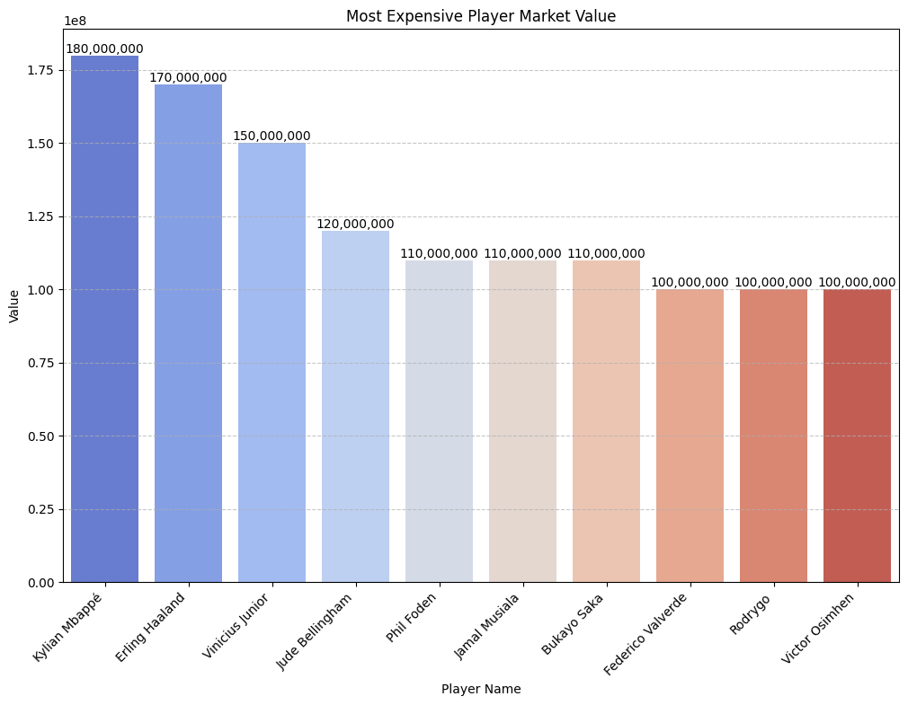
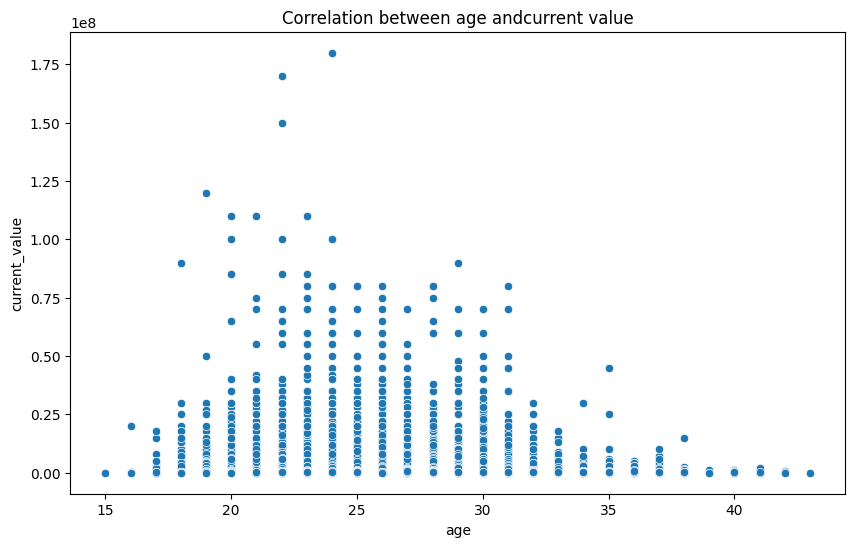

# 📌 The Football Players' Transfer Fee Prediction

## 📖 Overview
The Football Players' Transfer Fee Prediction project uses a dataset containing information about football players, including their current value, position, age, and other related features. The goal is to predict the transfer fee for a player based on this data using machine learning algorithms. The project focuses on Linear Regression for predicting the transfer fee.

---


## 📂 Dataset
#### Football Players' Transfer Fee Prediction Dataset
[kaggle page](https://www.kaggle.com/datasets/khanghunhnguyntrng/football-players-transfer-fee-prediction-dataset/data)

---

## 📦 Installation & Setup
### 🔹 Install Dependencies
Run the following command to install the required packages:
```bash
pip install numpy pandas matplotlib seaborn scipy ydata_profiling hijridate arabic_reshaper bidi
```

---

## 📌 Sample Output
### 📊 Most Transfer Fees of Player

---

### 📊 Correlation between age andcurrent value


---

## 🔗 Future Improvements
- **Predictive analysis** using another machine learning model.

🚀 **Contributions & feedback are welcome!**

